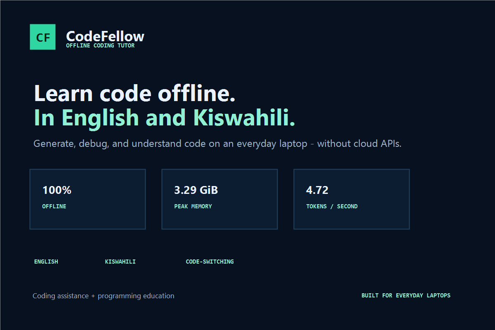
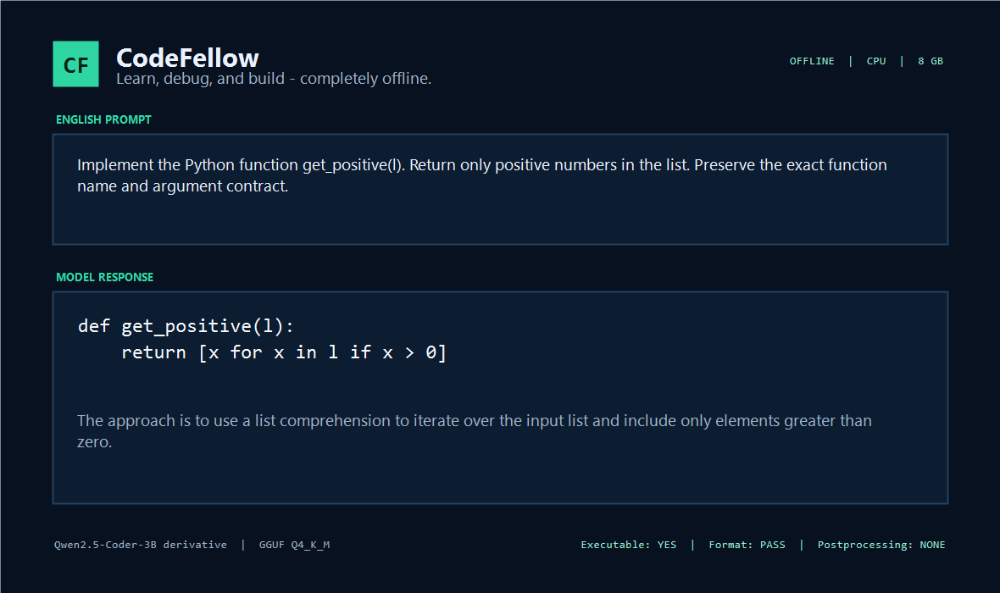
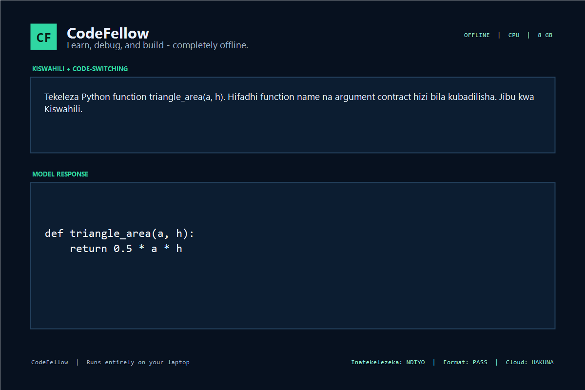

# CodeFellow

**Learn, debug, and build—no internet required.**

CodeFellow is a 3B on-device coding tutor specialized for English, Kiswahili, and the English–Kiswahili code-switching register used by programming students. The submitted artifact is one CPU-ready `Q4_K_M` GGUF. Kiswahili support is inside the model: the judged inference path uses no translator, cloud service, retrieval layer, response rewriter, or external tool.

The project targets the ADTC Standard Laptop: four CPU cores, 8 GB RAM, integrated graphics, and Ubuntu 22.04. It builds on Qwen2.5-Coder-3B-Instruct while retaining the small model's speed and memory advantage.

## Audited demo outputs



The response cards use executable code recorded in
`benchmark-results/submission-2026/declared-prompt-evidence.json`.





## What is different from the base model

The derivative was trained from the original BF16/FP16 parent, not from an existing GGUF:

- 10,000 assistant-response-only examples: 65% English coding replay, 20% Kiswahili tutoring, and 15% English–Kiswahili code-switching;
- parallel task triples keep the executable code identical and vary only the teaching language;
- generated Python and JavaScript are executed against task tests before admission;
- mutation tests reject weak test suites and incorrect solutions;
- LoRA checkpoints and merge strengths are gated against an untouched executable benchmark;
- the selected step-100 adapter is merged at 0.45 strength after uniform 0.35/0.45/0.50 and upper-layer controls;
- final `Q4_K_M` quantization uses an importance matrix balanced across English code, debugging, Kiswahili prose, code-switching, fences, JSON, tests, and strict output contracts.

This is deliberately a coding model that teaches, rather than a general translation model. Conventional terms such as `function`, `variable`, `array`, `list`, `loop`, `API`, `compiler`, and `runtime` remain in English when that is natural, while the surrounding explanation can be Kiswahili.

## Meaningful cross-disciplinary integration

CodeFellow combines **coding assistance + programming education**. Its model behavior is trained and evaluated for two load-bearing outcomes at once:

1. produce executable, contract-preserving code; and
2. teach the approach briefly in the learner's requested English, Kiswahili, or code-switched register.

The included offline application adds local syntax/test evidence and hint-first tutoring, but it is not needed for the language capability and is not included in model-only benchmark claims.

## Download and run the model

Requirements: Linux, a current `llama.cpp` build with `llama-cli`, about 2 GB free storage, and 8 GB RAM.

```bash
bash download_model.sh

llama-cli \
  -m model/CodeFellow-Q4_K_M.gguf \
  -t 4 -c 2048 -n 320 --temp 0 --jinja \
  -p 'Implement Python function square(x). Return one fenced Python code block and then explain it in one short Kiswahili sentence.'
```

The download is public, resumable, and SHA-256 verified. Once downloaded, inference is fully offline.

## Optional diagnostics-grounded tutor

`codefellow.py` reads one learner-selected Python or JavaScript file, obtains a local syntax diagnostic, and sends that evidence to the same GGUF. It never silently edits the source or executes model-generated code. A learner-supplied test command is optional, shell-free, time-limited, and clearly labeled as local evidence.

```bash
python3 codefellow.py examples/longest_unique_bug.py \
  --question 'Why is the answer for abba wrong?' --full-answer

python3 codefellow.py examples/average_bug.js \
  --language sw-mix --full-answer \
  --question 'Kwa nini function hii inafeli ikiwa array ni empty?'
```

Override the runtime paths when needed:

```bash
python3 codefellow.py app.py \
  --llama-cli /path/to/llama.cpp/build/bin/llama-cli \
  --model /path/to/CodeFellow-Q4_K_M.gguf
```

## Reproduce model-only evaluation

The independent screen contains 50 HumanEval-derived tasks whose canonical solutions were executed before inclusion. It rejects any task or close paraphrase overlapping the 662 source tasks used to construct training data. Public function signatures are restored after prose translation and verified exactly.

Run one raw-model lane through a local `llama-server` endpoint:

```bash
python3 evals/kiswahili/run_eval.py \
  --endpoint http://127.0.0.1:8181/v1/chat/completions \
  --model CodeFellow \
  --tasks benchmark-results/submission-2026/humaneval-screen50.json \
  --languages en,sw,sw_mix \
  --model-only --fresh \
  --output benchmark-results/submission-2026/codefellow-screen50.json
```

The strict format suite has 50 exact-output probes covering fenced code, JSON, and bullet contracts:

```bash
python3 evals/submission/run_format_eval.py \
  --endpoint http://127.0.0.1:8181/v1/chat/completions \
  --model CodeFellow \
  --output benchmark-results/submission-2026/codefellow-format50.json
```

`evals/submission/run_q4_comparison.sh` runs matched raw-model comparisons with four CPU cores, temperature zero, the native model template, and no application processing.

On the final 50-task screen, CodeFellow scored 39/50 English, 21/50 Kiswahili, and 24/50 code-switched executable passes, versus 38/50, 24/50, and 29/50 for the untouched Q4 base. The derivative improved strict-contract compliance from 30/50 to 35/50 and language adherence, but regressed localized executable accuracy. It was selected as a calculated competition tradeoff because the official profiler accuracy loss was only 0.02 and the African-use-case bonus can offset it. These limitations are disclosed rather than hidden.

## ADTC profiler

```bash
python3 -m venv .venv
source .venv/bin/activate
pip install 'git+https://github.com/Africa-Deep-Tech-Foundation/adtc-profiler.git'

taskset -c 0-3 adtc-profiler run \
  --submission . \
  --mode participant \
  --output submission.json
```

Submit the generated report without editing it. Development measurements are evidence, not a promise of identical organizer-hardware results.

The current full participant report records Team ID `codefellow`, commit `847b98bfd94f`, 0.82 ARC-Easy `acc_norm` over 50 samples, 4.74 generation tok/s, and 3,369.94 MiB peak RSS. Under the profiler's published formulas, the self-reported form values are **Sperf 31.60** and **Seff 52.99**. The five-run model-selection median was 4.67 tok/s with 3,370.16 MiB worst peak RSS. Raw reports are under `benchmark-results/submission-2026/`; all throughput runs use CPU-only `-ngl 0` execution.

## Reproducibility and audit files

- `metadata.json` — ADTC metadata and two declared model prompts
- `download_model.sh` — public checksum-verified GGUF download
- `REPORT.md` — training, selection, benchmark, and hardware report
- `training/` — dataset validation, LoRA, merge, importance-matrix, and release-gate scripts
- `evals/submission/` — independent task builder, strict format grader, model runner, and scorer
- `benchmark-results/submission-2026/` — chat-template audit, dataset manifest, quantization hashes, and raw result JSON
- `codefellow.py` — optional offline tutor using the submitted GGUF

## Safety and limitations

- The model is optimized for Python/JavaScript learning tasks, not autonomous deployment or security-critical code.
- Generated programs must still be reviewed and tested.
- Model-only evaluation executes candidate code only inside the evaluation harness with resource limits; the user application does not execute generated code.
- Kiswahili quality is targeted at natural programming code-switching, not general-purpose literary translation.

## License

Repository code is GPL-3.0. The derivative weights retain the Qwen Research License; see `NOTICE` and `THIRD_PARTY_LICENSES/QWEN_RESEARCH_LICENSE.txt`.
